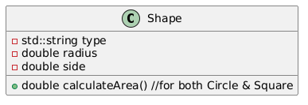
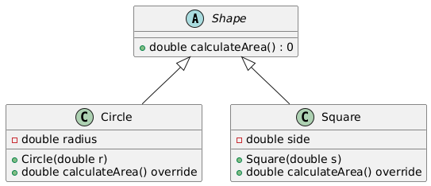

# Open/Closed Principle (OCP)

The Open/Closed Principle (OCP) is one of the five SOLID principles of object-oriented design. It asserts that a class should be designed in such a way that its behavior can be extended without altering its source code. By adhering to this principle, developers can add new functionality to a system without risking the introduction of bugs in existing code.

## Moto

**Software entities (classes, modules, functions, etc.) should be open for extension, but closed for modification.**

## Example Violating OCP

1. Imagine a `Shape` class that handles various shapes like `Circle` and `Square`.
2. If we want to add a new `shape`, we would need to modify the `Shape` class, which violates the OCP.

### Class Diagram - Violating OCP



### Code - Violating OCP

```cpp
#include <iostream>
#include <string>
#include <cmath>

class Shape {
public:
    std::string type;
    double radius;
    double side;

    double calculateArea() {
        if (type == "circle") {
            return M_PI * radius * radius;
        } else if (type == "square") {
            return side * side;
        }
        return 0;
    }
};

int main() {
    Shape circle;
    circle.type = "circle";
    circle.radius = 5.0;
    std::cout << "Area of Circle: " << circle.calculateArea() << std::endl;

    Shape square;
    square.type = "square";
    square.side = 4.0;
    std::cout << "Area of Square: " << square.calculateArea() << std::endl;

    return 0;
}
```

## Example Correcting OCP

1. To correct this, we can use `polymorphism`. Create an `abstract Shape` class with a `calculateArea()` method.
2. Each specific shape (e.g., `Circle`, `Square`) will extend the `Shape` class and implement the `calculateArea()`method.

### Class Diagram - Corrected OCP



### Code - Corrected OCP

```cpp
#include <iostream>
#include <cmath>

class Shape {
public:
    virtual double calculateArea() const = 0;  // Pure virtual function
    virtual ~Shape() = default;                // Virtual destructor
};

class Circle : public Shape {
private:
    double radius;
public:
    Circle(double r) : radius(r) {}

    double calculateArea() const override {
        return M_PI * radius * radius;
    }
};

class Square : public Shape {
private:
    double side;
public:
    Square(double s) : side(s) {}

    double calculateArea() const override {
        return side * side;
    }
};

int main() {
    Shape* circle = new Circle(5.0);
    std::cout << "Area of Circle: " << circle->calculateArea() << std::endl;
    delete circle;

    Shape* square = new Square(4.0);
    std::cout << "Area of Square: " << square->calculateArea() << std::endl;
    delete square;

    return 0;
}
```
