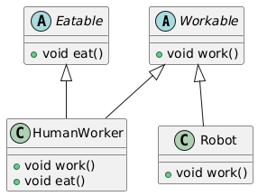

# Interface Segregation Principle (ISP)

The Interface Segregation Principle (ISP) is one of the five SOLID principles of object-oriented design. It asserts that a class should not be required to implement methods it doesn't need. Instead, smaller, more specific interfaces should be created to ensure that classes only implement the methods that are relevant to them.

## Moto

**Clients should not be forced to depend on interfaces they do not use.**

## Example Violating ISP

1. Consider the example where `Human` and `Robot` inherits from an abstract/ interface class `Worker`.
2. In this example, the `Worker` interface violates the `ISP` because it forces classes to implement methods they do not need. For example, `Robot` is forced to implement the `eat()` method even though it doesn't make sense for a `robot`.

### Class Diagram Violating ISP


### Code Violating ISP

```cpp
#include <iostream>

class Worker {
public:
    virtual void work() = 0;
    virtual void eat() = 0;
    virtual ~Worker() = default;
};

class HumanWorker : public Worker {
public:
    void work() override {
        std::cout << "Human is working..." << std::endl;
    }

    void eat() override {
        std::cout << "Human is eating..." << std::endl;
    }
};

class Robot : public Worker {
public:
    void work() override {
        std::cout << "Robot is working..." << std::endl;
    }

    void eat() override {
        // This method doesn't make sense for a robot, but it's required to implement it.
    }
};

int main() {
    HumanWorker human;
    human.work();
    human.eat();

    Robot robot;
    robot.work();
    robot.eat();  // Meaningless call

    return 0;
}
```

## Example Correcting ISP

1. To correct the `ISP` violation, we split the `Worker` interface into smaller, more specific interfaces: `Workable` and `Eatable`. Now, classes implement only the interfaces that are relevant to them.

### Class Diagram Correcting ISP



### Code Correcting ISP

```cpp
#include <iostream>

class Workable {
public:
    virtual void work() = 0;
    virtual ~Workable() = default;
};

class Eatable {
public:
    virtual void eat() = 0;
    virtual ~Eatable() = default;
};

class HumanWorker : public Workable, public Eatable {
public:
    void work() override {
        std::cout << "Human is working..." << std::endl;
    }

    void eat() override {
        std::cout << "Human is eating..." << std::endl;
    }
};

class Robot : public Workable {
public:
    void work() override {
        std::cout << "Robot is working..." << std::endl;
    }
};

int main() {
    HumanWorker human;
    human.work();
    human.eat();

    Robot robot;
    robot.work();
    // No meaningless eat() call

    return 0;
}
```
